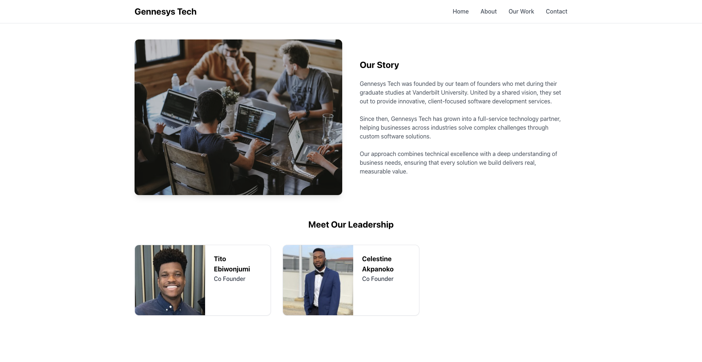

# Gennesys Technologies Website

## Overview

The official website for Gennesys Technologies, built with React and Vite.JS. This site showcases our products, team members, and company vision.



<!-- ## Features

- Responsive design across all devices
- Interactive product catalog
- Team member profiles
- Customer testimonials
- Contact form with validation
- Blog section with latest company news

## Technology Stack

- **Frontend**: React.js, Next.js
- **Styling**: Tailwind CSS
- **Animation**: Framer Motion
- **Deployment**: Vercel
- **CMS**: Contentful

## Getting Started

### Prerequisites

- Node.js (v16 or higher)
- npm or yarn

### Installation

1. Clone the repository
   ```bash
   git clone https://github.com/acme-corp/company-website.git
   cd company-website
   ```

2. Install dependencies
   ```bash
   npm install
   # or
   yarn install
   ```

3. Set up environment variables
   ```bash
   cp .env.example .env.local
   ```
   Then edit `.env.local` with your configuration values

4. Start the development server
   ```bash
   npm run dev
   # or
   yarn dev
   ```

5. Open [http://localhost:3000](http://localhost:3000) in your browser

## Deployment

The site is automatically deployed to Vercel when changes are pushed to the main branch.

For manual deployment:

```bash
npm run build
npm run start
```

## Contributing

1. Create a new branch (`git checkout -b feature/amazing-feature`)
2. Make your changes
3. Commit your changes (`git commit -m 'Add some amazing feature'`)
4. Push to the branch (`git push origin feature/amazing-feature`)
5. Open a Pull Request -->

## Contact

For questions or support, please email [gennesystech@gmail.com](mailto:gennesystech@gmail.com).

## License

This project is licensed under the MIT License - see the LICENSE file for details.